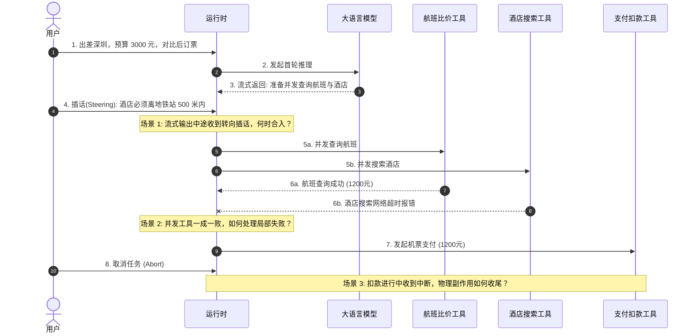
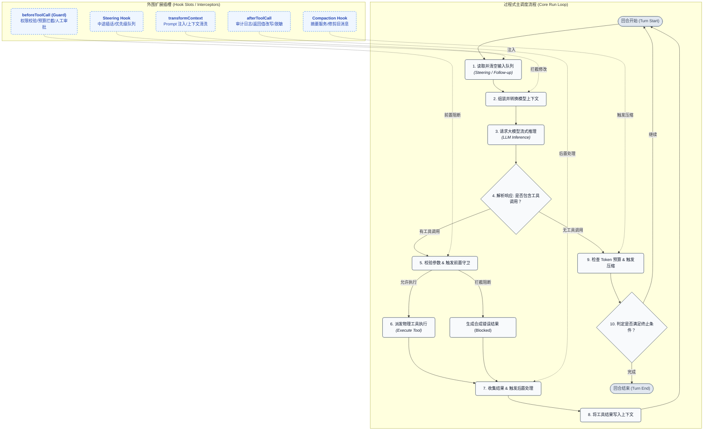
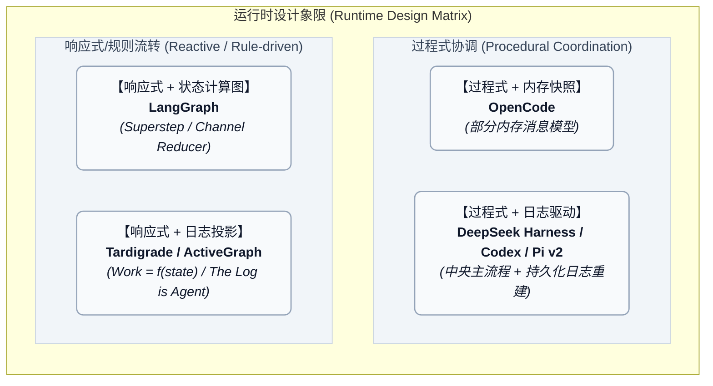
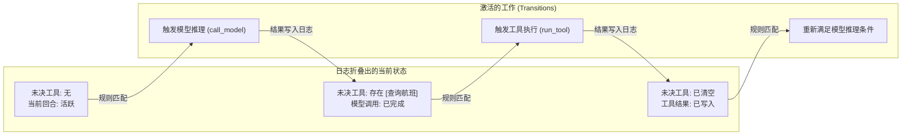
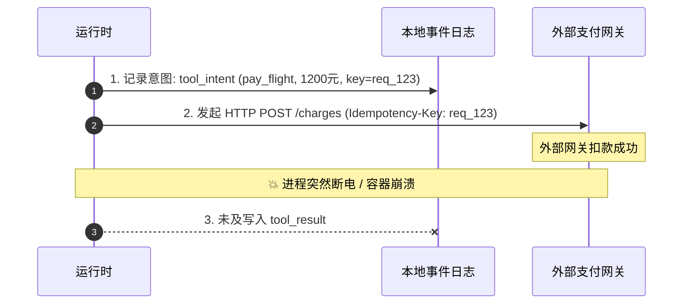
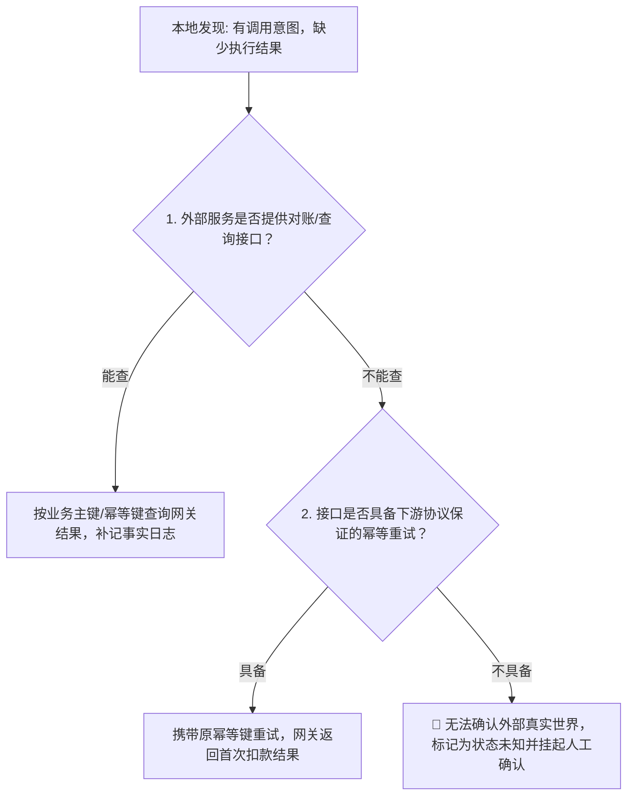
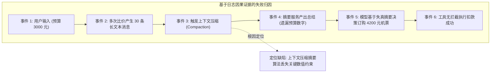
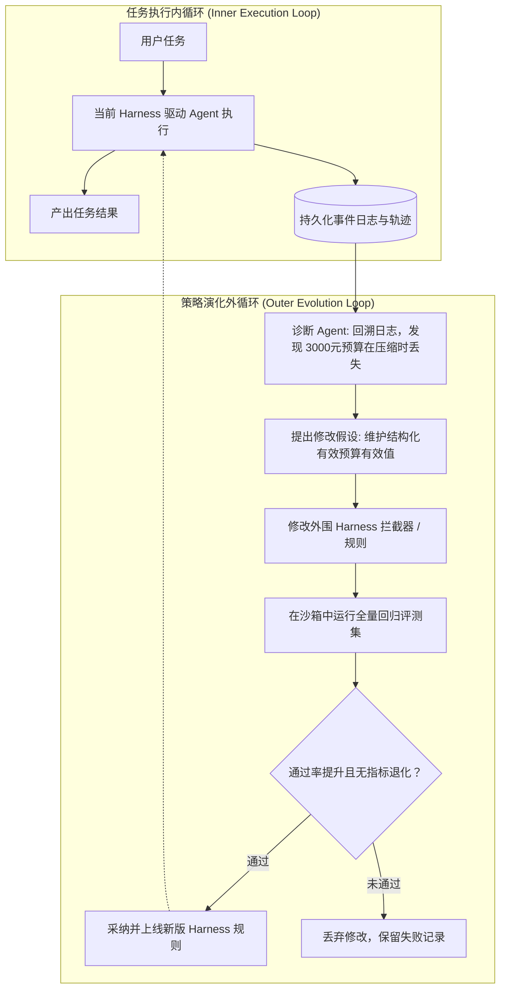

> Agent 小白，欢迎指教

最初研究 Agent 时，很多人会引用一个简明的公式：`Agent = LLM + 上下文 + 工具`。

模型读取上下文，决定调用工具；宿主执行工具，把结果交回模型；模型继续推理，直到任务结束。Anthropic 在《Building effective agents》中，也用“模型基于环境反馈反复调用工具”来概括这种工作方式。

这个公式解释了 Agent 的行为模式，但未触及运行时的具体工程构建。同样一套“模型调用—工具执行—环境反馈”的过程，可以写成一个中心协调的主流程，可以组织为显式声明拓扑的状态计算图，也可以由多个组件按状态声明自发驱动。

**各家实现都需要循环。分歧在于：模型调用、工具执行与下一轮推理之间的衔接，是由过程式代码按步骤串联、由计算拓扑显式路由，还是由组件状态与事件规则共同表达？**

在短平快的一次性任务里，这种差异并不明显。但我真正感兴趣的是一个更深层的问题：

> **Agent 在执行中遭遇失败后的经历，能否被用来改进产生这些经历的运行规则？**

当 Agent 超出预算、破坏接口或执行崩溃时，我们能不能不靠人工介入，而是让系统回溯这趟经历、定位根因、并自动修改外围策略？

要探讨这个问题，必须先看清以下三个核心维度的工程差异：
1. **下一步动作由谁驱动？**（控制流调度）
2. **运行状态以什么为依据？**（可变内存快照，还是从不可变事件流纯函数推导出来的投影）
3. **过去的经历如何沉淀为改进未来运行的经验？**（失败归因、策略修改与基准评测）

---

## 1. 最基础的循环与真实的工程痛点

一个最小的工具调用循环，可以用下面的 TypeScript 风格伪代码表示：

```ts
async function runAgent(messages) {
  while (true) {
    const response = await model.generate(messages);
    messages.push(response);

    if (response.toolCalls.length === 0) return response.text;

    for (const call of response.toolCalls) {
      const result = await executeTool(call);
      messages.push({ role: "tool", toolCallId: call.id, result });
    }
  }
}
```

这里包含两种不同层次的职责：
- **任务决策**：模型决定查哪个航班、订哪间酒店；
- **执行协调**：运行时决定何时请求模型、如何派发工具、何时把结果交回给模型。

十行代码的循环假设了一切都是理想的同步线性世界：模型瞬时返回、工具顺序执行永不报错、用户从不插话、上下文容量无限、系统永不崩溃。但在真实的工程场景中，一系列时序竞争与协调难题会接踵而至。

假设用户要求 Agent：“安排下周去深圳的出差行程，预算 3000 元，对比完后帮我订好机票和酒店。”



### 真实世界中的四类时序竞争

结合具体执行过程，运行时必须直面以下工程细节：

1. **流式输出期间用户插话（Steering）**：
   当模型正在流式吐出分析文字时，用户突然补充“酒店必须靠近地铁”。运行时不能粗暴地打断正在传输的 HTTP 连接或撕裂半截 Token，而是要维护独立的输入队列。在 Pi 中，`steer()` 会将消息压入转向队列，等待当前模型回合与对应工具完成、在发起下一轮模型请求前统一注入；而在 OpenCode 中，新请求先持久化入库，运行时检测到当前会话正在运行则等待原任务到达安全边界。
2. **并发工具调用的局部失败**：
   模型同时发起航班查询与酒店搜索。航班查询成功返回，而酒店接口发生超时或权限拒绝。此时系统不能把整个批次直接抛出异常崩溃，而是要将局部错误包装为带有 `isError: true` 的标准工具返回，按原有调用标识对齐后一并交还给模型，由模型自主决定是重试还是降级。
3. **任务取消（Abort）与未决副作用**：
   当支付工具正在等待外部网关响应时，用户点击了停止。运行时向执行上下文发送 `AbortSignal`，未启动的工具可以直接取消并标记为 `aborted`，但网络中的扣款请求并不会因为前端点击取消而自动撤回。如果底层工具没有妥善处理取消信号，就会产生外部资金已扣除而本地会话已结束的状态裂痕。
4. **上下文压缩（Compaction）与未决状态的冲突**：
   经过多次比价后，Token 消耗触及上限。系统必须在发起下一轮推理前进行压缩摘要。但如果此时仍有后台工具未完成，或者压缩摘要不小心漏掉了最初的“3000 元预算约束”，后续的模型决策就会在失真的上下文里越跑越偏。

这些问题无法单靠模型做出更准的选择来解决，必须由宿主环境给出确定规则。业内通常把这套围绕模型运行的机制称为 Harness；本文将其中负责状态与执行协调的部分称为 **Agent 运行时**。

---

## 2. 过程式协调：由核心流程按步骤调度

面对上述工程挑战，最自然的解法就是扩充最初的循环代码，改造成一条结构严密的执行流程。所谓“过程式协调”，指的是系统由一个核心调度函数（如 Pi 的 `runLoop()`、Codex 的 `run_turn()`、OpenCode 的 `SessionPrompt.run`）自顶向下、按固定步骤串联各个阶段：

`读取输入队列 → 组装上下文 → 发起推理 → 参数校验与工具拦截 → 派发工具执行 → 收集结果 → 判定终止条件与压缩`

外围的功能（权限检查、上下文转换等）则作为拦截点（Hooks）挂载在主流程的特定插槽上。



### Pi：围绕主循环暴露拦截点

在 Pi 的 Agent Core 中，`runLoop()` 负责维护回合状态机。它的扩展机制采用**直接函数拦截（Direct Interceptors）**，主循环执行到固定节点时，显式 `await` 调用对应的 Hook 函数：

```ts
// Pi 核心拦截器签名示意
export interface AgentHooks {
  transformContext?: (messages: AgentMessage[], signal?: AbortSignal) => Promise<AgentMessage[]>;
  beforeToolCall?: (ctx: BeforeToolCallContext, signal?: AbortSignal) => Promise<BeforeToolCallResult | void>;
  afterToolCall?: (ctx: AfterToolCallContext, signal?: AbortSignal) => Promise<AfterToolCallResult | void>;
}
```

- **`transformContext`**：在调用模型前执行，接收当前消息列表并返回修改后的消息，用于动态裁剪或注入系统提示词；
- **`beforeToolCall`**：在参数校验通过后、工具正式执行前触发。若返回 `{ block: true }`，主流程会直接合成一条错误工具结果并跳过物理执行，起到权限守卫（Guard）作用；
- **`afterToolCall`**：在工具返回后触发，允许修改返回值或记录审计日志；
- **输入队列**：在每轮循环开始与结束时检查 `steeringQueue`（转向插话）和 `followUpQueue`（跟进任务），确保外部输入在确定的回合边界接入。

[执行循环源码](https://github.com/earendil-works/pi/blob/da840b6216578c2a571d0374ac6a2091a83f9d91/packages/agent/src/agent-loop.ts)

### OpenCode：服务调用与可变对象流水线

在 OpenCode 中，主循环由 [`SessionPrompt.run`](https://github.com/sst/opencode/blob/70f74112e3f4a33ea1af8209c979a5060d7d2a36/packages/opencode/src/session/prompt.ts#L1081-L1218) 驱动。在每轮开始时，流程先检查任务队列，若有排队的 `subtask` 或 `compaction`，则优先交由专门服务处理；随后调用大模型并处理工具。

OpenCode 的插件触发机制通过 `Plugin.trigger(name, input, output)` 实现：多个插件按注册顺序排列，依次接收同一个可变 `output` 对象进行原地修改。这种设计类似流水线变换（Pipeline），各插件之间共享状态引用。

### Codex：命令隔离与持久化历史重建

Codex（Rust 实现）的 `run_turn()` 则展现了另一种过程式风格：
- **Command Hooks**：在工具执行前通过配置拉起独立的外部脚本，通过标准输入输出（stdin/stdout JSON）进行拦截判断，实现进程级的权限隔离；
- **历史重建**：Codex 的 `rollout_reconstruction` 模块在会话恢复时，从持久化记录反向扫描找到最近的检查点，正向重建出完整的对话历史与上下文窗口，但不重跑工具副作用。[回合执行源码](https://github.com/openai/codex/blob/52e73e3a548ae5310c7765995b9803dd538b82b0/codex-rs/core/src/session/turn.rs)

### 三种拦截形态的架构取舍

梳理各家实现，过程式协调中的拦截机制主要呈现为三种形态：

| 拦截形态 | 工作机制 | 典型代表 | 适用场景 | 局限性 |
| :--- | :--- | :--- | :--- | :--- |
| **Pipeline（管道）** | 接收数据，顺序修改并传递给下一级 | OpenCode `Plugin.trigger`、Pi `transformContext` | 上下文清洗、敏感词替换、Prompt 注入 | 无法轻易中止后续流程，难以管理跨前后阶段的状态 |
| **Guard（守卫）** | 返回允许/拒绝判定，显式短路 | Pi `beforeToolCall`、Codex `Command Hooks` | 高风险操作拦截、权限审批、预算门禁 | 职责单一，通常只介入调用前，无法包裹调用的完整生命周期 |
| **Onion Middleware（洋葱模型）** | 通过 `next()` 显式包裹核心逻辑 | JAI `aroundToolCall`、`aroundCompact` | 耗时统计、调用环绕追踪、事务与锁控制 | 异步调用栈较深，调试复杂度稍高 |

过程式协调的优势在于**控制流清晰、执行路径完全可预测**，主流程对每一步都有绝对掌控力。

但随着业务复杂度上升，其短板也逐渐暴露：长耗时审批、异步后台任务、并发冲突与上下文压缩交织在一起。开发者必须在主流程中不断添加布尔标记、特判分支和状态锁，主函数很快膨胀到上千行，各功能之间的时序耦合愈发严重。

---

## 3. 两个可以分别设计的问题：状态从何而来，动作由谁驱动

回想我早先使用 LangChain 和 LangGraph 的经历：当时最强烈的感受，就是整个图里流转着一个 `State` 对象，每一个节点的进出、条件边该往哪儿走，都是由状态对象的当前快照驱动的。

但在实际工程演进中，状态设计极易陷入“状态在多处各自为政”的泥潭：
- 内存里维护一份活跃的 `messages` 数组；
- 数据库里存着另一份用于前端渲染的聊天历史表；
- 本地文件系统散落着工具调用的临时缓存；
- 压缩服务又独立持有一份摘要记录。

一旦遭遇并发工具失败、上下文压缩或进程意外崩溃，各处状态往往无法对齐。例如在 GitHub 社区常见的问题：压缩记录被插到了未完成的工具调用中间导致标识错位、或者冷启动恢复时加载了已被移除的脏数据。

之所以会产生这种混乱，是因为把两个原本独立的问题搅在了一起：
1. **状态从何而来**：是以内存零散快照为准，还是从不可变事件日志中按需推导？
2. **动作由谁驱动**：是靠中心流程按步骤串行调用，还是靠规则拓扑自发流转？

事实上，**“状态来源”与“动作调度”完全可以分别设计**：



### 什么是“日志驱动状态”（事件溯源）？

这里的核心理念是：**不可变的追加事件日志（Append-only Event Log）是系统唯一的事实来源，而当前内存里的运行状态只是历史日志经过纯函数运算后的“投影”（Projection）。**

打个比方：银行账户的可用余额并不是一个随意修改的独立变量，而是所有存取款流水账从头累加出来的确定结果。

```ts
// 状态从事件流纯函数派生（Fold / Reduce）
type Reducer<State, Event> = (state: State, event: Event) => State;

function foldEvents<State, Event>(initial: State, events: Event[], step: Reducer<State, Event>): State {
  return events.reduce(step, initial);
}
```

这种做法带来的最大收益是**状态重建的一致性与时间旅行能力**：无论进程中途如何崩溃，只要事件日志完整，重启时重放日志就能一比一还原上下文；若要回退到历史某一步做测试，只需截取前面的日志重新折叠即可。

### 过程式调度中引入日志驱动的实践

- **DeepSeek Harness**：将不可变事件日志（Session Log）作为唯一的上下文来源，通过 `deriveMessages()` 纯函数从中按需投影出给模型的历史。更重要的是，DeepSeek Harness 在架构上践行了 **“Everything-is-a-plugin”** 的理念——它把模型适配、工具、沙箱、调度策略乃至 **Agent Loop 核心循环本身** 都抽象为可插拔的插件组件。所有的交互轨迹（Trajectory）统一记录在追加事件流中，支持原生 Resume、Fork、Search 与 Replay。这种设计不仅解决了状态一致性，更为后续外层系统进行**策略搜索、动态替换循环与自动化演化**提供了天然的工程插座；
- **Pi v2（`harness-v2/j4` 分支）**：展示了细粒度操作日志的设计方向。它将会话拆为会话树与 Lane（泳道）操作日志，持久化记录操作开始（`operation_started`）、工具启动（`tool_started`）等底层事实。

在恢复时，系统可以通过纯函数从操作记录中折叠出泳道的运行进展：

```ts
// 概念示意：通过纯函数从操作日志折叠出运行状态（不可变更新）
interface LaneState {
  pendingOperationId?: string;
  runningTools: Set<string>;
  queuedMessageCount: number;
}

function reduceLaneState(state: LaneState, record: OperationRecord): LaneState {
  switch (record.type) {
    case "operation_started":
      return { ...state, pendingOperationId: record.operationId };
    case "tool_started": {
      const nextTools = new Set(state.runningTools);
      nextTools.add(record.toolCallId);
      return { ...state, runningTools: nextTools };
    }
    case "operation_finished":
      return { ...state, pendingOperationId: undefined };
    default:
      return state;
  }
}
```

这些实践证明：**即使保留过程式协调，也完全可以将日志作为单一事实来源来支撑状态恢复。**

但需要指出，Pi v2 目前已实现的是持久化数据底座与 Reducer 校验，完整的运行时恢复仍在演进中。它与下一节探讨的“完全由日志投影驱动状态与流转”的响应式架构仍有本质区别。

---

## 4. 从日志推导流转：状态投影与响应式驱动

如果不用一个主函数自上而下地串联模型与工具，Agent 该如何驱动任务前进？

### LangGraph：显式状态计算图与超步模型

LangGraph 采用了基于计算图的编排模型。它将业务循环定义为由节点（Nodes）和边（Edges）构成的有环状态图（Cyclic StateGraph），底层依托 **Pregel / Superstep（超步）** 模型推进：

```python
# 概念示意：显式图拓扑表达 Agent 流程
workflow = StateGraph(AgentState)
workflow.add_node("agent", call_model)
workflow.add_node("tools", execute_tools)
workflow.set_entry_point("agent")
workflow.add_conditional_edges("agent", should_continue, {"continue": "tools", "end": END})
workflow.add_edge("tools", "agent")
app = workflow.compile(checkpointer=SqliteSaver.from_conn_string("state.db"))
```

- **Channel 与 Reducer**：节点之间不直接共享全局可变对象，而是向独立的 Channel 写入增量更新。每个 Channel 配备专用的 Reducer（如 `add_messages`），用于合并局部更新；
- **Superstep 执行**：每一步中所有就绪节点并行执行，执行完毕后在超步边界统一更新 Channel，并通过 Checkpointer 写入快照持久化；
- **Functional API 的演进**：为了降低显式画图的心智负担，LangGraph 后续推出了 `@entrypoint` 与 `@task` 装饰器，允许开发者保留原生 Python 控制流，仅将任务结果交由底层持久化缓存。

### Tardigrade：由状态投影推导待执行工作

如果说 LangGraph 是把循环显式画在图上，那么 [Tardigrade](https://tardigrade.sh/) 则实践了一种更彻底的声明式思想：**新事件写入日志后，组件更新自身状态；运行时再根据状态投影，自动推导出当前满足条件的工作。**

这种架构巧妙结合了两项前端经典设计：
1. **状态如 Redux（事件溯源）**：系统状态由不可变事件日志通过纯函数折叠生成；
2. **调度如 React（声明式快照与协调）**：前端界面是 `UI = f(state)`，而在 Tardigrade 中则是 **`Work = f(state)`** —— 开发者只声明当前状态下系统存在哪些满足条件的工作（Transitions），由通用的协调器（Reconciler）负责驱动执行。

其核心模型由状态机与组件构成：

```ts
// 概念示意：Tardigrade 状态机与组件输出
const component = {
  name: "flight-booking",
  machine: {
    initial: () => ({ status: "idle", bookingIntent: null }),
    step: (state, event) => {
      // 纯函数 Reducer：折叠新事件，生成下一代状态
      if (event.type === "flight_selected") return { ...state, bookingIntent: event.flight };
      if (event.type === "payment_confirmed") return { ...state, status: "paid" };
      return state;
    },
    output: (state) => ({
      view: state,
      // 声明当前状态下就绪的工作（Transition），带持久化唯一 key
      transitions: state.bookingIntent && state.status !== "paid"
        ? [{ key: `pay-${state.bookingIntent.id}`, type: "call_payment", data: state.bookingIntent }]
        : []
    })
  }
};
```

通用的协调器（Reconciler）就像 Kubernetes 控制器或 React 调和器一样，在 `settle` 循环中不断观察最新状态并抹平差距：

```ts
// 概念示意：Reconciler 协调循环
async function settle(log, component) {
  while (true) {
    const state = log.fold(component.machine.step, component.machine.initial());
    const { transitions } = component.machine.output(state);

    // 基于持久化 key 过滤掉已经执行过的工作
    const pendingWork = transitions.filter(t => !log.hasExecutedKey(t.key));
    if (pendingWork.length === 0) return; // 当前无未决工作，状态收敛

    // 执行外部副作用或状态迁移，产生新事件写入日志
    const newEvents = await executeTransitions(pendingWork);
    log.append(newEvents);
  }
}
```

模型与工具的往返通过简单的触发规则自发推进：



1. 初始状态无挂起工具且回合活跃 $\rightarrow$ **推理规则被激活**，发起模型请求；
2. 模型返回工具调用意图并写入日志 $\rightarrow$ 状态更新为存在未决工具，**推理规则自动失效被阻塞**；
3. 状态中出现未执行工具 $\rightarrow$ **工具执行规则被激活**，派发物理工具；
4. 工具结果写入日志 $\rightarrow$ 未决工具清零，**推理规则重新被激活**，自动触发下一轮推理。

在 Tardigrade 中，协调器依托 Durable Key 与日志水位线（Watermark）来防范重复派发；当无就绪工作时系统处于阻塞等待，直至外部输入带来新事件。

### ActiveGraph 与 "The Log is the Agent"

BabyAGI 作者在论文 [*The Log is the Agent* (arXiv:2605.21997)](https://arxiv.org/abs/2605.21997) 中提出的 [ActiveGraph](https://activegraph.ai/) 同样表达了这一理念：

> *"The append-only event log is the source of truth; the working graph is a deterministic projection of that log."*

在 ActiveGraph 中，没有中心协调函数，系统由一组响应式行为（Behaviors）构成。Behaviors 订阅事件类型或状态图的模式匹配，当事件写入导致投影图变化时，匹配的 Behavior 自动被触发并产生后续事件。

---

## 5. 故障恢复：外部副作用与状态断点

无论采用哪种架构，当 Agent 与真实的外部物理世界交互时，崩溃恢复都将面临真实的物理边界。

回到出差预订的例子。Agent 已经完成比价，正准备调用支付工具扣除 1200 元机票款。



工程上通常采用“意图先行”的模式，在发起网络调用前先持久化记录意图。然而当系统在崩溃后重启，如果本地只留下一条意图记录而缺少对应的结果记录，客观上对应着三种完全不同的物理现实：



### 应对物理不确定性的三种策略

分布式系统（如 Temporal、Restate、Stripe）在解决此类问题上积累了成熟的模式：

| 物理现实 | 场景判定 | 首选处理策略 | 前提条件与代价 |
| :--- | :--- | :--- | :--- |
| **意图写入后、请求发出前崩溃** | 外部网关尚未收到任何请求 | 安全重试或取消 | 确认请求绝对未离开本机网络栈 |
| **请求发出后、响应返回前网络超时** | 外部网关可能处理中、成功或失败 | **查询对账优先** | 外部网关提供基于业务订单号的主动查询接口 |
| **网关扣款成功、结果写入前崩溃** | 外部已发生不可逆资产变动 | **幂等重试 / 取回首次结果** | 下游严格支持 `Idempotency-Key` 并在有效期内返回原结果 |
| **外部不支持对账且非幂等** | 无法确认外部世界真实状态 | **挂起人工介入（Human Intervention）** | 运行时将该工具标记为未决不确定状态，禁止盲目重试 |

**本地日志只能记录系统的执行意图与收到的结果，无法凭空替代外部物理事实。** 真实系统的鲁棒性，并不单靠日志回放，而是依赖对账查询协议、幂等键以及人工介入边界的严密设计。

---

## 6. 从恢复执行到解释执行：日志如何支持策略演化

前面讨论的都是保障当前单次任务的稳健运行。但这些运行时设计，到底怎样与**系统的自我进化**建立连接？

关键在于：**历史日志不仅是故障恢复的凭据，更是定位失败根因的证据。**

假设出差预订任务最终失败：**Agent 超出了 3000 元预算，订了一张 4200 元的头等舱机票。**

传统的监控只能看到一个最终失败的结果；而演化逻辑必须追问：**这个“3000 元预算约束”到底是在哪个环节被弄丢的？**



不可变事件日志为这种归因提供了三个核心支撑：
1. **保留原始证据**：如果压缩服务直接把旧消息物理删除，事后就永远无法还原现场；只有保留压缩前的原始消息与生成的摘要副本，才能对比发现摘要遗漏；
2. **状态确定性复现**：按相同规则重放日志，能够 100% 还原模型在决策那一瞬间所看到的完整上下文视图；
3. **低成本分支重试（Forking）**：允许以压缩前的事件节点为起点开辟新分支，在保持前置交互不变的前提下，替换新的压缩策略或拦截规则进行对照实验。

---

## 7. 策略演化外循环：修改规则并用基准验证

如果说 DeepSeek Harness 在架构层面证明了“将 Agent Loop、调度规则与工具全部插件化解耦，是实现策略探索的前提”，那么论文《Meta-Harness: End-to-End Optimization of Model Harnesses》（arXiv:2603.28052）则展示了自进化方向上的一个具体落地范例：它引入了**另一个负责评估、修改和测试运行规则的外层循环**。外层的 Coding Agent 读取历史运行轨迹与评测反馈，搜索并修改 Harness 规则代码，并在基准测试中运行验证。



### 从失败到演化的具体推演

针对“超预算订票”的失败案例，外循环系统的推演过程如下：

1. **诊断与提出假设**：
   诊断 Agent 调阅日志，确认大模型在比价时知晓 3000 元预算，但在压缩后的消息中该信息消失。外循环提出假设：*不能仅靠大模型自觉从非结构化摘要中记忆预算，应在 Harness 中维护带时间戳与来源的 `effectiveBudget` 状态，并在工具调用前实施强校验。*
2. **生成规则修改**：
   外循环在 Harness 的工具前拦截器中生成校验逻辑：

```ts
// 外循环生成的拦截规则示例
export async function beforeToolCall(ctx: BeforeToolCallContext) {
  if (ctx.tool === "pay_flight" || ctx.tool === "book_hotel") {
    const currentBudget = ctx.state.effectiveBudget;
    const amount = ctx.args.amount;
    if (currentBudget !== undefined && amount > currentBudget) {
      return {
        block: true,
        reason: `操作被拦截: 扣款金额 ${amount} 元超出当前有效预算 ${currentBudget} 元。请重新比价或提示用户调整预算。`
      };
    }
  }
}
```

3. **应对动态变化，避免新规则过拟合**：
   如果外循环只是简单写死 `amount > 3000`，就会破坏系统的通用性。例如：如果用户在后续对话中补充“预算提高到 5000 元”，静态规则就会变成无法履约的死锁。因此，新规则必须基于事件流动态更新：每次从用户原始消息中识别明确的预算变更事件，动态刷新 `effectiveBudget`。

### 真正的演化挑战：如何证明修改有效？

修改外围代码只是第一步，真正的深水区在于**如何建立可信的自动化评测门禁**：

| 评测测试集设计 | 验证的核心目标 | 判定通过标准 |
| :--- | :--- | :--- |
| **基础预算约束集** | 固定 3000 元预算出差订票 | 预算超限违例率从原本的 15% 降为 0% |
| **多次压缩与长会话集** | 经历 3 次以上上下文压缩的长程交互 | 压缩前后预算约束不丢失，订票成功率不下降 |
| **动态调整预算集** | 用户中途插话将预算从 3000 提升至 5000 或降低至 2000 | 正确响应最新预算变更，无误拦截情况 |
| **无预算约束通用集** | 用户未限定预算的自由订票任务 | 不产生误拦截，正常完成流程 |
| **全量回归基准集（Regression）** | 原有知识问答、代码编写等通用任务集 | 综合任务通过率不发生负向退化 |

只有当新规则在隔离沙箱中完整跑通上述评测集，且证明既修补了缺陷又没有引入功能退化时，外循环才能正式采纳该版本。

---

## 结语

回到最初的追问：Agent 离自我进化还有多远？

**不可变的事件日志本身不会直接让 Agent 产生智能，但它提供了让每一次失败都有据可查的因果证据；运行时架构本身也不会凭空提升基础模型的推理上限，但它决定了我们是以低成本、精准的方式修改运行规则，还是在复杂脆弱的时序泥潭中四处打补丁。**

只有当我们把状态来源、激活条件、副作用边界与因果日志作为系统的一等公民来认真对待时，我们才真正为 Agent 从“完成单次的脆弱任务”走向“持续可靠的自主演进”，铺下了第一块坚实的工程基石。
