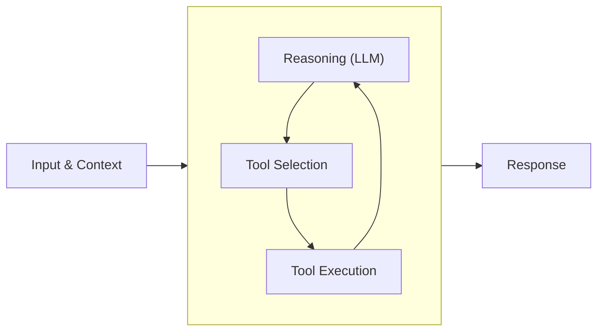

## 前言

非常推荐阅读：[claude code 的 agent-loop 是如何运行的](https://code.claude.com/docs/en/agent-sdk/agent-loop ) ，agent 的核心十分简单



1. 接收你的输入
2. 评估和响应，根据当前的状态确定下一步的操作，可能会返回文本，也可能会请求一个或者多个工具，都这都有
3. 执行工具，如果有工具，需要把工具结果回传给模型
4. 重复，2 和 3 一直循环，直到不再调用工具且产生响应为止
5. 返回结果

其强大之处在于上下文的累积。每次循环迭代都会增加对话历史记录。模型不仅能看到原始请求，还能看到它调用过的每一个工具以及收到的每一个结果。这种累积的上下文信息使得复杂的多步骤推理成为可能。

## 类型定义
### AgentToolResult

```ts title="/packages/agent/src/types.ts"
import type { ImageContent, TextContent } from "@jai/ai";

export interface AgentToolResult<TDetails = unknown> {
	/** 回给模型的内容（会被包进 ToolResultMessage 送回 LLM）。 */
	content: (TextContent | ImageContent)[];
	/** 给日志 / UI 的结构化数据，不进 LLM 上下文。 */
	details?: TDetails;
	/**
	 * 提示 agent 在当前这批工具执行完后停止。
	 * 早停仅当本批次每个工具结果都为 true 时才生效
	 */
	terminate?: boolean;
}

/** 长任务在 execute 途中回调，驱动 tool_execution_update 事件。 */
export type ToolUpdateCallback<TDetails = unknown> = (partial: AgentToolResult<TDetails>) => void;

```

### AgentTool

```ts
import type { Static, TSchema } from "@sinclair/typebox";
import type { Tool } from "@jai/ai";

export type ToolExecutionMode = "sequential" | "parallel";

export interface AgentTool<T extends TSchema = TSchema, TDetails = unknown> extends Tool<T> {
  /** UI 展示用的人类可读标签，缺省用 name。 */
  label?: string;
  /**
   * 执行工具。参数已由 loop 用 Spec 06 校验并 coerce，这里直接拿干净的 Static<T>。
   * 失败请 throw，由 loop 捕获转成 isError 的 ToolResultMessage。
   */
  execute(
    toolCallId: string,
    args: Static<T>,
    signal?: AbortSignal,
    onUpdate?: ToolUpdateCallback<TDetails>,
  ): Promise<AgentToolResult<TDetails>>;
  /**
   * 单个工具的执行模式覆盖：
   * - "sequential"：此工具必须与其他工具串行执行（如写文件、跑命令）。
   * - "parallel"：可与其他工具并发（如只读查询）。
   * 缺省跟随 loop 的全局模式（Spec 10）。
   */
  executionMode?: ToolExecutionMode;
}
```

1. **`execute` 不负责校验参数**。参数校验是 loop 的职责，工具拿到的一定是符合 schema 的值。校验失败的 tool call 根本不会走到 `execute`，loop 直接落一条 error result，这里已经有一点 harness 的味道了。
2. **`execute` 失败就 throw**。抛出的 `Error.message` 会成为 error tool result 的文本。工具**不要**自己返回"错误内容"来表达失败（那样 `isError` 无从判断）。
3. **`onUpdate` 仅在本次 `execute` 期间有效**。这可以帮助一些可能执行比较长的工具，在内部去更新某些状态，以此让外部知道
4. `executionMode`可以支持我们做一些并发操作，model 返回的 tool 毕竟是串行，如果 agent 要读 10 个文件，串行的效率太低了，就需要支持并行

### Agent Event

在 Provider 层我们已经定义过一次 `AssistantMessageEvent`，为什么 Agent 层还要再定义 `AgentEvent`？因为这两个事件虽然长得相似，但它们描述的是不同层级的生命周期

```ts
export type AssistantMessageEvent =
	| { type: "start"; partial: AssistantMessage }
	| { type: "text_start"; contentIndex: number; partial: AssistantMessage }
	| { type: "text_delta"; contentIndex: number; delta: string; partial: AssistantMessage }
	| { type: "text_end"; contentIndex: number; content: string; partial: AssistantMessage }
	| { type: "thinking_start"; contentIndex: number; partial: AssistantMessage }
	| { type: "thinking_delta"; contentIndex: number; delta: string; partial: AssistantMessage }
	| { type: "thinking_end"; contentIndex: number; content: string; partial: AssistantMessage }
	| { type: "toolcall_start"; contentIndex: number; partial: AssistantMessage }
	| { type: "toolcall_delta"; contentIndex: number; delta: string; partial: AssistantMessage }
	| { type: "toolcall_end"; contentIndex: number; toolCall: ToolCall; partial: AssistantMessage }
	| { type: "done"; reason: Extract<StopReason, "stop" | "length" | "toolUse">; message: AssistantMessage }
	| { type: "error"; reason: Extract<StopReason, "error" | "aborted">; error: AssistantMessage };

```

`AssistantMessageEvent` 只关心一次模型响应内部发生了什么：文本开始、文本增量、thinking 增量、tool call 增量、最终 done/error。它的边界是一条 assistant message，也就是一次 provider stream，由于这是离模型调用最近的地方，如果要求事件事件的准确性，也只能在这里做，而不是放在 agent loop 这一层。

而 `AgentEvent` 关心的是 agent 运行过程发生了什么：一个任务什么时候开始、一次 turn 什么时候开始、assistant message 如何流式更新、工具什么时候开始执行、工具执行过程中有什么进度、工具结果什么时候进入 transcript、整个 agent run 什么时候结束。它的边界不是一条 message，而是一次完整的 agent run。Agent 事件表达任务执行过程，把模型输出、工具执行、transcript 更新这些动作组织成一个完整的 agent 生命周期。

```ts title="packages/agent/src/types.ts"
import type {
  AssistantMessage,
  AssistantMessageEvent,
  ToolResultMessage,
} from "@jai/ai";

export type AgentEvent =
  // agent 生命周期：一次 run 的最外层边界
  | { type: "agent_start" }
  | { type: "agent_end"; messages: AgentMessage[] }
  // turn 生命周期：一个 turn = 一条 assistant 回复 + 它触发的工具执行
  | { type: "turn_start" }
  | { type: "turn_end"; message: AssistantMessage; toolResults: ToolResultMessage[] }
  // message 生命周期：user / assistant / toolResult 消息进入 transcript
  | { type: "message_start"; message: AgentMessage }
  // 仅 assistant 流式期间发出，透传底层 provider 的细粒度事件
  | { type: "message_update"; message: AssistantMessage; assistantEvent: AssistantMessageEvent }
  | { type: "message_end"; message: AgentMessage }
  // 工具执行生命周期
  | { type: "tool_execution_start"; toolCallId: string; toolName: string; args: unknown }
  | { type: "tool_execution_update"; toolCallId: string; toolName: string; partial: AgentToolResult }
  | { type: "tool_execution_end"; toolCallId: string; toolName: string; result: AgentToolResult; isError: boolean };

```
